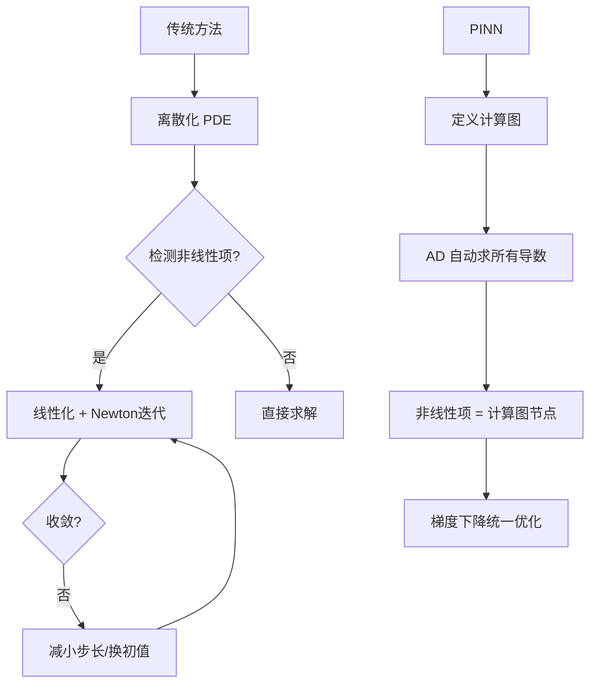

# 方法展开：非线性 PDE 如何在 PINN 中被"免费"处理

## 5.1 问题形式化

考虑参数化的非线性 PDE 一般形式：
$$u_t + \mathcal{N}[u; \lambda] = 0, \quad x \in \Omega, \; t \in [0, T]$$

其中 $\mathcal{N}[u; \lambda]$ 是含参数 $\lambda$ 的非线性算子。例如：
- Burgers: $\mathcal{N} = u u_x - \nu u_{xx}$
- Allen-Cahn: $\mathcal{N} = -0.0001 u_{xx} + 5u^3 - 5u$

## 5.2 连续时间模型 (Section 3)

### 网络架构

$$u(x, t) \approx f_\theta(x, t)$$

- 输入: (x, t) ∈ ℝ^(d+1)
- 输出: u (标量或向量)
- 架构: 全连接网络，5-8 层，每层 40-100 神经元
- 激活: tanh (默认)

### ⚡ 非线性项通过自动微分的处理

**核心机制：** Python 代码展示 AD 如何处理非线性：

```python
# TensorFlow 1.x 风格
def pinn_net(x, t):
    u = neural_net(tf.concat([x, t], 1))
    u_t = tf.gradients(u, t)[0]
    u_x = tf.gradients(u, x)[0]
    u_xx = tf.gradients(u_x, x)[0]

    # === 非线性 PDE 残差 — AD 透明处理 ===
    # Burgers 方程
    f = u_t + u * u_x - nu * u_xx
    #        ^^^^^^^^ 非线性对流项，AD 无额外开销

    return u, f
```

**关键洞察：**
- `u * u_x` 是计算图上的两个节点相乘 → AD 自动处理
- 不需要 Newton-Raphson！不需要 Jacobian 组装！
- 非线性项的计算成本 ≈ 线性项

### 损失函数

$$\mathcal{L} = \mathcal{L}_{data} + \mathcal{L}_{PDE} + \mathcal{L}_{BC} + \mathcal{L}_{IC}$$

| 项 | 含义 | 计算方式 |
|----|------|---------|
| $\mathcal{L}_{data}$ | 数据拟合（可选） | MSE(u_pred, u_true) |
| $\mathcal{L}_{PDE}$ | PDE 残差 | MSE(f, 0)，其中 f 通过 AD 计算 |
| $\mathcal{L}_{BC}$ | 边界条件 | MSE(u_boundary, u_bc) |
| $\mathcal{L}_{IC}$ | 初始条件 | MSE(u_initial, u_ic) |

### 训练协议

1. **第一阶段:** Adam 优化器，学习率 10⁻³ → 10⁻⁵
2. **第二阶段:** L-BFGS 精调（准牛顿法，更快局部收敛）
3. 配点数: 10,000-50,000 (域内) + 100-500 (边界)

## 5.3 离散时间模型 (Section 4)

### 动机

连续时间模型在长时间积分时误差累积。离散时间模型使用 **Runge-Kutta 时间步进**：

$$u^{n+1} = u^n + \Delta t \sum_{i=1}^{q} b_i k_i$$

其中 $k_i$ 通过 PINN 隐式求解：
$$k_i = \mathcal{N}[u^n + \Delta t \sum_{j=1}^{q} a_{ij} k_j; \lambda]$$

### 隐式 Runge-Kutta 的 PINN 实现

关键创新：**将 Runge-Kutta 的隐式关系也作为物理约束**

$$\mathcal{L}_{RK} = \sum_{n} \sum_{i} \left| k_i^n - \mathcal{N}[u^n + c_i \Delta t \sum_j a_{ij} k_j^n] \right|^2$$

这使得时间步长可取到 Δt ~ 0.5-1.0（远大于显式方法的 CFL 限制）。

## 5.4 非线性 PDE 类型的 AD 处理对比

| 非线性类型 | 数学形式 | AD 计算 | 传统方法等效 |
|-----------|---------|---------|------------|
| 对流 | $u \cdot \nabla u$ | `u * u_x` | 迎风格式 + Newton |
| 反应 | $u(u^2-1)$ | `u*(u**2-1)` | 源项线性化 |
| 复值 | $|u|^2 u$ | 实部+虚部分别 | 复数矩阵求逆 |
| 高阶导数 | $u_{xxxx}$ | 4 次 `grad` 调用 | 窄模板有限差分 |

## 5.5 为什么 AD 处理非线性比传统方法更优雅



无分支，无迭代——**非线性被 AD 编译为有向无环图上的确定性操作**。

## 页内导航

- [[raissi2019-pinn-analysis|← 总览]]
- [[raissi2019-pinn-results|结果展开 →]]
- [[raissi2019-pinn-critical|批判分析 →]]

## Evidence By Source

### `sources/papers/raissi2019-pinn.md`

- Key point: 本页内容由所列来源整理；跨领域应用明确作为迁移推论或研究建议。
- Evidence location: 详见正文中的章节、表格、公式与可复现性说明。
- Original material: `raw/papers/10_1016_j_jcp_2018_10_045.xml`

^[sources/papers/raissi2019-pinn.md]
